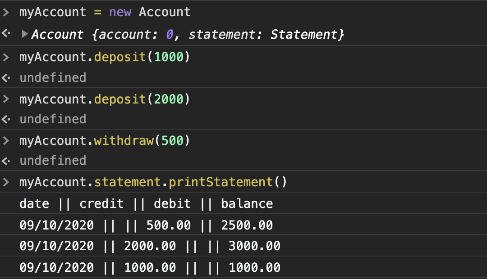

# Bank tech test

## Requirements 
- You should be able to interact with your code via a REPL like IRB or the JavaScript console. (You don't need to implement a command line interface that takes input from STDIN.)
- Deposits, withdrawal.
- Account statement (date, amount, balance) printing.
- Data can be kept in memory (it doesn't need to be stored to a database or anything).


### Acceptance criteria
**Given** a client makes a deposit of 1000 on 10-01-2012

**And** a deposit of 2000 on 13-01-2012

**And** a withdrawal of 500 on 14-01-2012

**When** she prints her bank statement

**Then** she would see
```
date || credit || debit || balance
14/01/2012 || || 500.00 || 2500.00
13/01/2012 || 2000.00 || || 3000.00
10/01/2012 || 1000.00 || || 1000.00
```

## User Stories

```
As a user,
So that I can save money,
I want to be able to deposit money into my account.
```
```
As a user,
So that I can spend money,
I want to be able to withdraw money from my account.
```
```
As a user,
So that I can keep an eye on my spending,
I want to be able to view a statement of my account.
```
```
As a user,
So that I know when I have deposited or withdrawn from my account,
I want there to be dates for each transaction listed on my statement.
```

## My code

I wanted my code to be simple to use and easy to read. 

Therefore my code consists of 1 class with 4 methods, each of them no longer than 2 lines. 

I believe that my code is dry and runs well.

I struggled with mocking in Jasmine, but I managed to get it working and I'm proud of that fact.

I did however have trouble with installing a test coverage tool.

I am still looking into how to do that in Javascript, hopefully that will be the next thing I add to this project. 

## Installation

To install the project:
```
npm install
```
### ESlint
To run ESlint:
```
npx eslint ./src/Bank.js
```
### Run Tests
To run nyc Jasmine:
```
npm test
```

## Use Bank App

- Please run the code in a JavaScript console

To start a new account run:
```
accountName = new Account
```
To deposit money into your account:
```
accountName.deposit(amount)
```
To withdraw money from your account:
```
accountName.withdraw(amount)
```
To check a statement of your account:
```
accountName.statement.printStatement()
```
## Screenshot example



